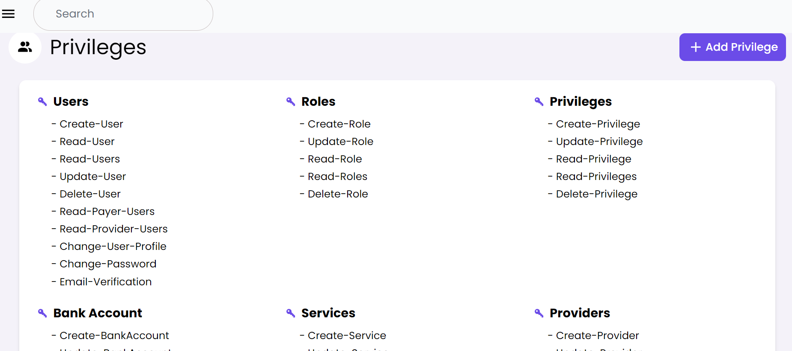
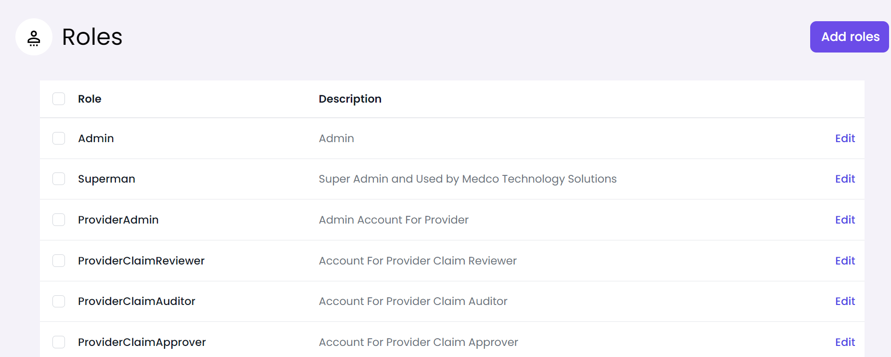
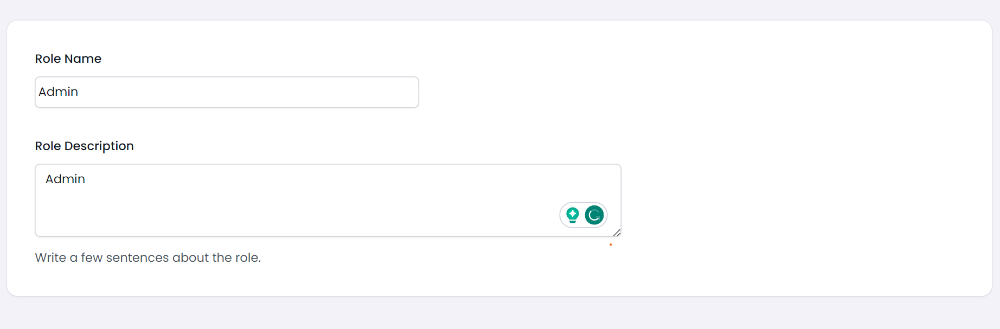
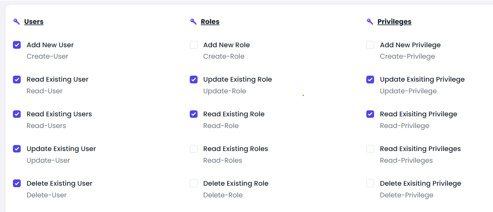
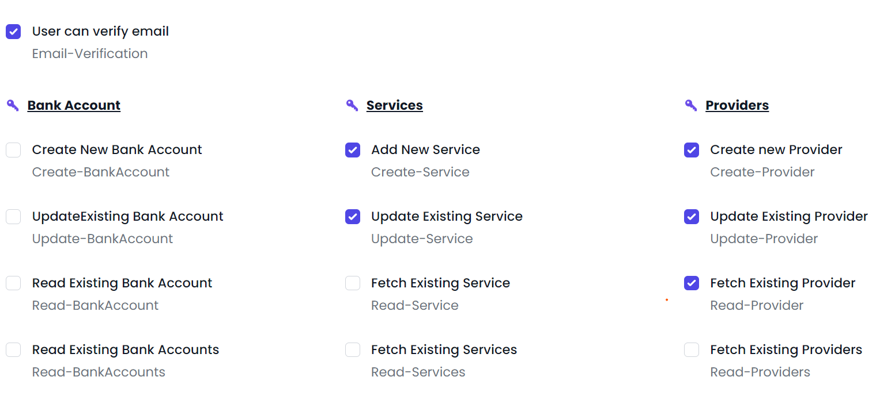

## Dynamic Role and Privilege Authentication, Authorization and Auditing Using Spring Security and JWT

# API Access Privileges

This project includes API endpoints that require specific privileges for access. Each endpoint is secured using role-based access control. 

## Example: Creating a Role

To access the API for creating a new role, the following Java method is defined:

```java
@PostMapping
@PreAuthorize("hasRole('Create-Role')")
public Role createRole(@Valid @RequestBody RoleRequest roleRequest)


- Here, ‘Create-Role’ is the privilege necessary to access this API.



- Incorporate the privileges, defined for each API in the controllers, into the database using the privileges controller in Swagger.


### You can Create dyanmic roles using the role managment API
 - Create A Role  like Admin, Supper Admin, or whatever you need
 
 - Assign Privileges to the role from the list of privileges registered above.
 

 

 

### Access Swagger using 
- http://localhost:8195/swagger-ui/index.html#/